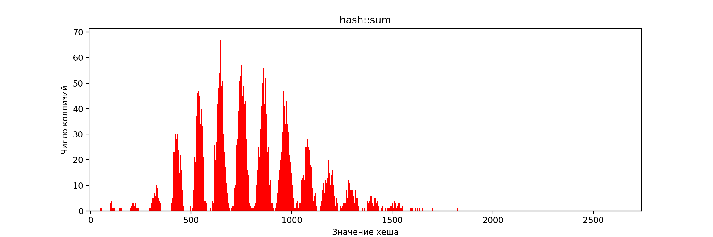
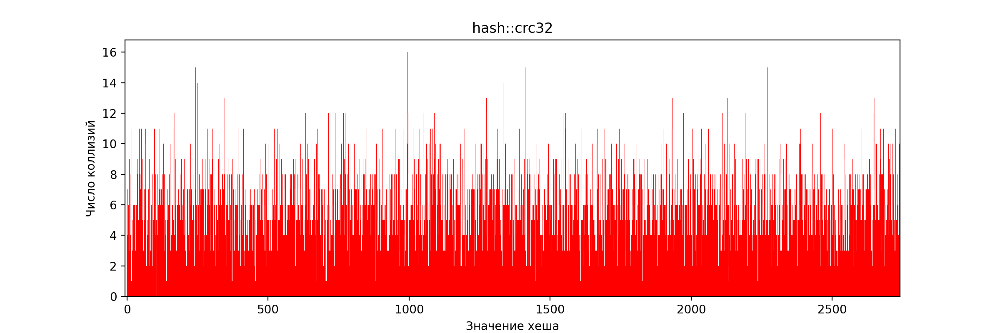

# Оптимизация поиска в хеш-таблице
## Аннотация
В данной работе будет рассматриваться хеш-таблица, написанная методом списков.
Главной целью работы поставим максимально возможную оптимизацию поиска значения
в хеш-таблице по ключу, то есть при оптимизации будем пользоваться в том числе
аппаратными возможностями архитектуры CPU (в нашем случае это будет x86-64), но
лишь там, где это действительно способно дать заметное ускорение.

## Входные данные
В качестве источника ключей для хеш-таблицы возьмем слова из английского текста
романа Л. Н. Толстого "Война и мир" (15001 уникальное слово). Весь словарь (
с повторениями) находится в данном [файле](data/dictionary.txt).
Значением будем
считать число вхождений данного ключа в весь наш словарь.

При исследовании хеш-функций возьмем размер хеш-таблицы в
2741 список, чтобы средний размер одного списка (_load factor_) получился ~5.5.
В реальности такое значение слишком велико и приводит к медленному линейному поиску в
связном списке, но оно было выбрано умышленно, так как
при исследовании хеш-функции на частоту коллизий определяющим фактором
является ее распределение по значениям, а значит, нам необходимо, чтобы оно
было статистически достоверным.

## Выбор подходящей хеш-функции
Перейдем к отбору подходящих для нашей работы хеш-функций. Наиболее подходящими
являются функции с распределением значений, наиболее близким к равномерному.
Отсюда наша методика будет заключаться в следующем:
1. Создать хеш-таблицу с заданной хеш-функцией.
2. Загрузить ее ключами из словаря.
3. Найти размер всех списков и посчитать его стандартное отклонение.

Распределение из п. 3 также представим на гистограммах для визуализации.

Помимо равномерности распределения, важной характеристикой хеш-функции является
время ее работы.

За время работы будем считать время подсчета хеша от всех слов в нашем словаре.
При замерах времени здесь и далее будем устанавливать процессор на максимально
возможную частоту утилитой `cpupower` и выдавать нашему процессу максимальный приоритет
утилитой `nice`. Для непосредственно измерений применим функцию стандартной библиотеки `chrono`:
`std::chrono::high_resolution_clock::now()`. Для уменьшения погрешности будем повторять процесс 10 раз.
Повторим эксперимент 100 раз,
усредним результаты и посчитаем стандартное отклонение.

_**ПРИМЕЧАНИЕ:**_ время работы не измерялось для заведомо неэффективных, то есть не покрывающих
весь диапазон значений, хеш-функций.

### Константа
Всегда возвращает ноль.
```cpp
uint64_t hash::zero([[maybe_unused]] const char key[]) {
    return 0;
}
```

Стандартное отклонение: 288

Функция не покрывает весь диапазон значений. Более того, с ней поиск по хеш-таблице
фактически равносилен поиску по односвязному списку.

### Первый символ
Возвращает ASCII-код первого символа ключа.
```cpp
uint64_t hash::firstChar(const char key[]) {
    return (uint64_t)key[0];
}
```

Стандартное отклонение: 70

Приближение ненулевого участка:
.png)

Функция не покрывает весь диапазон значений, так как ASCII-коды английских букв
умещаются в диапазоне [97, 123]. Поэтому она неэффективна.

### Длина строки
Возвращает длину ключа.
```cpp
uint64_t hash::strlen(const char key[]) {
    return ::strlen(key);
}

```

Стандартное отклонение: 99

Приближение ненулевого участка:
.png)

Функция не покрывает весь диапазон значений, так как длина английских слов заведомо
не превышает 32. Поэтому она снова неэффективна.

### Сумма символов
Возвращает сумму ASCII-кодов символов ключа.
```cpp
uint64_t hash::sum(const char key[]) {
    uint64_t sum = 0;

    for (; *key; ++key)
        sum += (unsigned char)*key;

    return sum;
}
```

Для данной хеш-функции соберем статистику сначала при намеренно урезанном размере
хеш-таблицы в 101 список:

.png)

По предыдущей диаграмме может показаться, что функция имеет некоторое право на существование:
весь диапазон покрыт. Однако вот что произойдет, если проверить эту хеш-функцию на нашем основном
размере в 2741 список:


Стандартное отклонение: 12

Снова становится очевидной неэффективность данной функции. Ее ограниченность следует
из ограниченности двух предыдущих.

### ROR hash
После каждого суммирования циклически сдвигает результат вправо.
```cpp
uint64_t hash::ror(const char key[]) {
    uint64_t hash = 0;

    for (; *key; ++key)
        hash = ((hash >> 1) | (hash << 63)) + (unsigned char)*key;

    return hash;
}
```

Стандартное отклонение: 4.4</br>
Время работы: (4.70 ± 0.09) мс

Эта функция уже покрывает весь диапазон значений. Однако визуально наблюдаются
ярко выраженные пики на диаграмме, поэтому ее нельзя назвать подходящей.

_**ЗАМЕЧАНИЕ:**_ имеет смысл обратить внимание на реализацию циклического сдвига.
Как известно, в языке C++ нет операторов циклического сдвига, несмотря на наличие
соответствующих инструкций в процессорах x86-64. Поэтому при реализации мы были вынуждены
использовать 2 обычных битовых сдвига и побитовое "или". Проверим, как справится с
оптимизацией компилятор:


Это является результатом работы оптимизатора в backend-части компилятора.

### ROL hash
После каждого суммирования циклически сдвигает результат влево.
```cpp
uint64_t hash::rol(const char key[]) {
    uint64_t hash = 0;

    for (; *key; ++key)
        hash = ((hash << 1) | (hash >> 63)) + (unsigned char)*key;

    return hash;
}
```

Стандартное отклонение: 3.2 </br>
Время работы: (4.65 ± 0.05) мс

Интересно, что несмотря на внешне схожую природу этой функции с ROR hash,
она дала гораздо уже лучшее распределение. Однако не будем останавливаться на достигнутом
и продолжим поиски.

### CRC32
```cpp
uint64_t hash::crc32(const char key[]) {
    uint32_t crc = 0xffffffff;
    uint32_t mask = 0;

    for (; *key; ++key) {
        crc ^= (unsigned char)*key;
        for (int i = 7; i >= 0; --i) {
            mask = -(crc & 1);
            crc = (crc >> 1) ^ (0xedb88320 & mask);
        }
    }

    return ~crc;
}
```

Стандартное отклонение: 2.4</br>
Время работы: (12.94 ± 0.03) мс

### GNU hash
```cpp
uint64_t hash::gnu(const char key[]) {
    uint64_t hash = 5381;

    for (; *key; ++key) {
        hash = ((hash << 5) + hash) + (unsigned char)*key;
    }

    return hash;
}
```

Стандартное отклонение: 2.4</br>
Время работы: (4.64 ± 0.02) мс

### Сравнение хеш-функций
Для наглядности представим всю собранную о хеш-функциях статистику в таблице и на диаграмме.

|       Хеш       | Стандартное отклонение |  Время, мс   |
| :-------------: | :--------------------: | :----------: |
|   hash::zero    |          288           |      --      |
| hash::firstChar |           70           |      --      |
|  hash::strlen   |           99           |      --      |
|    hash::sum    |           12           |      --      |
|    hash::ror    |          4.4           | 4.70 ± 0.09  |
|    hash::rol    |          3.2           | 4.65 ± 0.05  |
|   hash::crc32   |          2.4           | 12.94 ± 0.03 |
|    hash::gnu    |          2.4           | 4.64 ± 0.02  |


### Промежуточный вывод
Эффективнее всего себя показали функции CRC32 и GNU hash.
