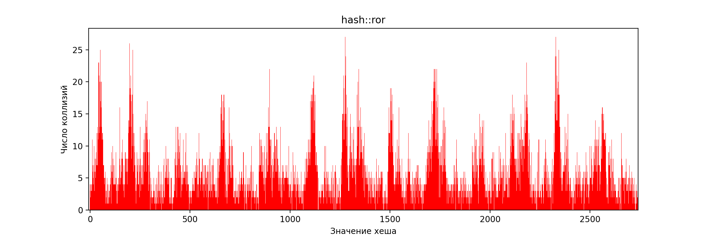
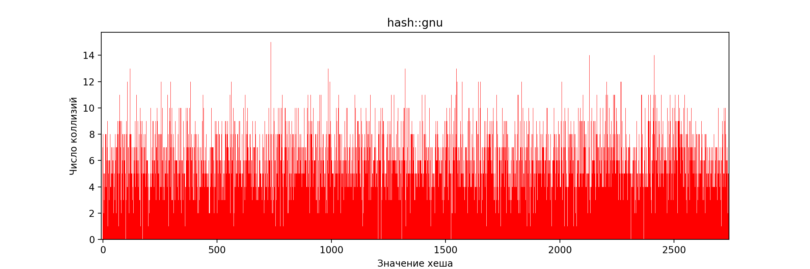

# Оптимизация поиска в хеш-таблице
## Аннотация
В данной работе будет рассматриваться хеш-таблица, написанная методом списков.
Главной целью работы поставим максимально возможную оптимизацию поиска значения
в хеш-таблице по ключу, то есть при оптимизации будем пользоваться в том числе
аппаратными возможностями архитектуры CPU (в нашем случае это будет x86-64), но
лишь там, где это действительно способно дать заметное ускорение.

## Входные данные
В качестве источника ключей для хеш-таблицы возьмем слова из английского текста
романа Л. Н. Толстого "Война и мир" (15001 уникальное слово). Весь словарь (
с повторениями) находится в данном [файле](data/dictionary.txt).
Значением будем
считать число вхождений данного ключа в весь наш словарь.

При исследовании хеш-функций возьмем размер хеш-таблицы в
2741 список, чтобы средний размер одного списка (_load factor_) получился ~5.5.
В реальности такое значение слишком велико и приводит к медленному линейному поиску в
связном списке, но оно было выбрано умышленно, так как
при исследовании хеш-функции на частоту коллизий определяющим фактором
является ее распределение по значениям, а значит, нам необходимо, чтобы оно
было статистически достоверным.

## Тестовая машина
Параметры тестовой машины:
|  Параметр  |                    Значение                     |
| :--------: | :---------------------------------------------: |
| Процессор  | Intel(R) Core(TM) i5-8400H @ 2.50 GHz Kaby Lake |
|     ОС     |       Debian GNU/Linux 12 (kernel 6.1.0)        |
| Компилятор |                  Clang 14.0.6                   |

## Выбор подходящей хеш-функции
Перейдем к отбору подходящих для нашей работы хеш-функций. Все тестируемые
функции имеют сигнатуру `uint64_t hash(const char*)` и предназначены для
C-style строк.

Наиболее подходящими
являются функции с распределением значений, наиболее близким к равномерному.
Отсюда наша методика будет заключаться в следующем:
1. Создать хеш-таблицу с заданной хеш-функцией.
2. Загрузить ее ключами из словаря.
3. Найти размер всех списков и посчитать его стандартное отклонение.

Распределение из п. 3 также представим на гистограммах для визуализации.

Помимо равномерности распределения, важной характеристикой хеш-функции является
время ее работы.

За время работы будем считать время подсчета хеша от всех слов в нашем словаре.
При замерах времени здесь и далее будем устанавливать процессор на максимально
возможную частоту утилитой `cpupower`. Для непосредственно измерений применим функцию стандартной библиотеки `chrono`:
`std::chrono::high_resolution_clock::now()`. Для уменьшения погрешности будем повторять процесс 10 раз.
Повторим эксперимент 100 раз,
усредним результаты и посчитаем стандартное отклонение.

_**ПРИМЕЧАНИЕ:**_ время работы не измерялось для заведомо неэффективных, то есть не покрывающих
весь диапазон значений, хеш-функций.

### Константа
Всегда возвращает ноль.
```cpp
uint64_t hash::zero([[maybe_unused]] const char key[]) {
    return 0;
}
```

Стандартное отклонение: 288

Функция не покрывает весь диапазон значений. Более того, с ней поиск по хеш-таблице
фактически равносилен поиску по односвязному списку.

### Первый символ
Возвращает ASCII-код первого символа ключа.
```cpp
uint64_t hash::firstChar(const char key[]) {
    return (uint64_t)key[0];
}
```

Стандартное отклонение: 70

Приближение ненулевого участка:
.png)

Функция не покрывает весь диапазон значений, так как ASCII-коды английских букв
умещаются в диапазоне [97, 123]. Поэтому она неэффективна.

### Длина строки
Возвращает длину ключа.
```cpp
uint64_t hash::strlen(const char key[]) {
    return ::strlen(key);
}

```

Стандартное отклонение: 99

Приближение ненулевого участка:
.png)

Функция не покрывает весь диапазон значений, так как длина английских слов заведомо
не превышает 32. Поэтому она снова неэффективна.

### Сумма символов
Возвращает сумму ASCII-кодов символов ключа.
```cpp
uint64_t hash::sum(const char key[]) {
    uint64_t sum = 0;

    for (; *key; ++key)
        sum += (unsigned char)*key;

    return sum;
}
```

Для данной хеш-функции соберем статистику сначала при намеренно урезанном размере
хеш-таблицы в 101 список:

.png)

По предыдущей диаграмме может показаться, что функция имеет некоторое право на существование:
весь диапазон покрыт. Однако вот что произойдет, если проверить эту хеш-функцию на нашем основном
размере в 2741 список:


Стандартное отклонение: 12

Снова становится очевидной неэффективность данной функции. Ее ограниченность следует
из ограниченности двух предыдущих.

### ROR hash
После каждого суммирования циклически сдвигает результат вправо.
```cpp
uint64_t hash::ror(const char key[]) {
    uint64_t hash = 0;

    for (; *key; ++key)
        hash = ((hash >> 1) | (hash << 63)) + (unsigned char)*key;

    return hash;
}
```

Стандартное отклонение: 4.4</br>
Время работы: (4.70 ± 0.09) мс

Эта функция уже покрывает весь диапазон значений. Однако визуально наблюдаются
ярко выраженные пики на диаграмме, поэтому ее нельзя назвать подходящей.

_**ЗАМЕЧАНИЕ:**_ имеет смысл обратить внимание на реализацию циклического сдвига.
Как известно, в языке C++ нет операторов циклического сдвига, несмотря на наличие
соответствующих инструкций в процессорах x86-64. Поэтому при реализации мы были вынуждены
использовать 2 обычных битовых сдвига и побитовое "или". Проверим, как справится с
оптимизацией компилятор:


Это является результатом работы оптимизатора в backend-части компилятора.

### ROL hash
После каждого суммирования циклически сдвигает результат влево.
```cpp
uint64_t hash::rol(const char key[]) {
    uint64_t hash = 0;

    for (; *key; ++key)
        hash = ((hash << 1) | (hash >> 63)) + (unsigned char)*key;

    return hash;
}
```

Стандартное отклонение: 3.2 </br>
Время работы: (4.65 ± 0.05) мс

Интересно, что несмотря на внешне схожую природу этой функции с ROR hash,
она дала гораздо уже лучшее распределение. Однако не будем останавливаться на достигнутом
и продолжим поиски.

### CRC32
```cpp
uint64_t hash::crc32(const char key[]) {
    uint32_t crc = 0xffffffff;
    uint32_t mask = 0;

    for (; *key; ++key) {
        crc ^= (unsigned char)*key;
        for (int i = 7; i >= 0; --i) {
            mask = -(crc & 1);
            crc = (crc >> 1) ^ (0xedb88320 & mask);
        }
    }

    return ~crc;
}
```

Стандартное отклонение: 2.4</br>
Время работы: (12.94 ± 0.03) мс

_**ЗАМЕЧАНИЕ:**_ хеш-функция поддается аппаратному ускорению, что, как будет
показано далее, существенно уменьшает время работы.

### GNU hash
```cpp
uint64_t hash::gnu(const char key[]) {
    uint64_t hash = 5381;

    for (; *key; ++key) {
        hash = ((hash << 5) + hash) + (unsigned char)*key;
    }

    return hash;
}
```

Стандартное отклонение: 2.4</br>
Время работы: (4.64 ± 0.02) мс

### Сравнение хеш-функций
Для наглядности представим всю собранную о хеш-функциях статистику в таблице и на диаграмме.
Последней в таблице указана ускоренная intrinsic-реализация CRC32, которая будет подробно
обсуждаться далее.

|       Хеш       | Стандартное отклонение |  Время, мс   |
| :-------------: | :--------------------: | :----------: |
|   hash::zero    |          288           |      --      |
| hash::firstChar |           70           |      --      |
|  hash::strlen   |           99           |      --      |
|    hash::sum    |           12           |      --      |
|    hash::ror    |          4.4           | 4.70 ± 0.09  |
|    hash::rol    |          3.2           | 4.65 ± 0.05  |
|   hash::crc32   |          2.4           | 12.94 ± 0.03 |
|    hash::gnu    |          2.4           | 4.64 ± 0.02  |
| hash::crc32_sse |          2.4           | 0.98 ± 0.06  |


### Промежуточный вывод
Эффективнее всего себя показали функции CRC32 и GNU hash. По времени работы у написанного
вручную алгоритма CRC32 GNU hash выигрывает заметно. Но, как будет показано далее,
CRC32 поддается весьма серьезному ускорению с использованием аппаратных возможностей
процессора. Поэтому дальнейшую работу мы будем вести именно с CRC32, а не GNU hash.

## Оптимизация поиска
_В образовательных целях_ в данных части оставим число списков в хеш-таблице
неизменным. Хотя самая первая оптимизация, которую стоило бы сделать -- это увеличить
размер хеш-таблицы, чтобы он был по крайней мере не меньше числа уникальных слов
(обычно рекомендуют load factor ~0.75).

### Методика измерений
За время работы функции поиска будем считать время поиска всего словаря в хеш-таблице.
Измерять будем так же, как и время работы хеш-функций. Компилировать будем так же
с флагами оптимизатора `-O3`.

### v1. Наивная реализация
Односвязный список реализован классическим способом, на узлах следующего типа:
```cpp
        struct Node {
            char key[defaults::MaxKeySize]; // 32 байта
            Value value; // 4 байта
            Node* next; // 8 байт
        };
```

Каждый узел лежит отдельно в динамической памяти, память выделяется функцией `malloc()`.

Измерим время по описанной методике. Занесем в таблицу:
| Версия | Время работы, мс | Ускорение относительно предыдущей версии | Ускорение относительно v1 |
| :----: | :--------------: | :--------------------------------------: | :-----------------------: |
|   v1   |      55 ± 1      |                    -                     |             -             |

В дальнейшем по данной таблице будем отслеживать прогресс оптимизаций, поскольку
в какой-то момент пора будет остановиться, чтобы не испортить нашу хеш-таблицу большим количеством
ассемблерного кода.

Температура процессорных ядер непосредственно после измерений
(получена при помощи пакета `lm-sensors`):
<details>
<summary>Скриншот</summary>

.
</details>

### v2. Оптимизация работы с памятью
Предыдущая версия имеет серьезный недостаток: узлы списка лежат по произвольным адресам
памяти, из-за чего даже один узел может не влезть целиком кеш-линию. К тому же, очевидно,
что одна кеш-линия может вместить ни больше ни меньше 2 ключа. Для этого необходимо
расположить все ключи в одном массиве рядом друг с другом и выравнять этот массив по
64 байта (размер одной кеш-линии).

Проверим наше предположение о нерациональном использовании кеша при помощи профилировщика
Perf. Вывод `perf stat`:


Действительно, есть куда улучшать. Из предыдущих соображений перепишем нашу реализацию
списка следующим образом:
```cpp
    class Bucket {
        // Cache-friendly
        Key* keys_;
        Value* values_;
        size_t* next_;
        size_t free_;

        size_t size_;
        size_t capacity_;

       public:
        bool create();

        size_t size() const { return size_; }
        size_t capacity() const { return capacity_; }

        size_t head() const { return next_[0]; }

        bool reserve(size_t newCapacity);

        Value* insertAfter(size_t index, const char key[], unsigned value);

        Value* pushFront(const char key[], unsigned value) {
            return insertAfter(0, key, value);
        }

        Value* find(const char key[]) const {
            for (size_t i = head(); i != 0; i = next_[i]) {
                if (strcmp(keys_[i], key) == 0)
                    return values_ + i;
            }

            return nullptr;
        }

        void destroy();
    };
```
В методе `create()` будем выделять массив `keys_` функцией `aligned_alloc()`, выравнивая
его по 32 байта. Таким образом, мы снова оптимизируем кеш, исключая попадание ключа меж двух
разных кеш-линий,
а так же открываем дорогу для
последующих жестких оптимизаций.

Количество промахов кеша сократилось, в соответствии с первоначальным предположением:


| Версия | Время работы, мс | Ускорение относительно предыдущей версии | Ускорение относительно v1 |
| :----: | :--------------: | :--------------------------------------: | :-----------------------: |
|   v1   |      55 ± 1      |                    -                     |             -             |
|   v2   |      39 ± 1      |               1.41 ± 0.06                |        1.41 ± 0.06        |

Итак, наша оптимизация использования памяти дала значительный прирост производительности.
Перейдем к локальным ассемблерным оптимизациям.

### v3. Оптимизация CRC32
Посмотрим на flame graph функции поиска `HashMap::find()`, построенный приложением Hotspot
по данным, собранным Perf во время профилирования программы:


Нетрудно видеть, что `hash::crc32()` занимает очень заметную (32%) часть времени поиска,
при том, что после подсчета данной функции происходит линейный поиск по цепочке средней
длины 5-6. Вспомним, что наш процессор умеет вычислять CRC32 на аппаратном уровне и
используем это. Напишем версию этой функции на Intel intrinsics с учетом известной нам
длины ключа:
```cpp
uint64_t hash::crc32_sse(const char key[]) {
    uint64_t crc = 0;

#pragma clang diagnostic push
#pragma clang diagnostic ignored "-Wcast-align"
    // Цикл развернут вручную для гарантии
    crc = _mm_crc32_u64(crc, *(const uint64_t*)key + 0);
    crc = _mm_crc32_u64(crc, *(const uint64_t*)key + 1);
    crc = _mm_crc32_u64(crc, *(const uint64_t*)key + 2);
    crc = _mm_crc32_u64(crc, *(const uint64_t*)key + 3);
#pragma clang diagnostic pop

    return crc;
}
```
Код пока оставляет желать лучшего, но на данный момент функция писалась
из соображений совместимости прототипа с предыдущими. В нашем
сценарии использования массив ключей выделяется функцией `malloc()`,
которая по стандарту обязана выдавать выравнивание, совместимое с любым из примитивных типов,
а значит и с `uint64_t`. Конечно же, это решение чисто временное и
в дальнейшем будет
еще одно улучшение, пока же нас интересует прирост производительности от
данной оптимизации.


Эффект виден невооруженным взглядом: наша хеш-функция почти исчезла с flame graph,
ее время работы теперь составляет всего 4% времени поиска.

| Версия | Время работы, мс | Ускорение относительно предыдущей версии | Ускорение относительно v1 |
| :----: | :--------------: | :--------------------------------------: | :-----------------------: |
|   v1   |      55 ± 1      |                    -                     |             -             |
|   v2   |      39 ± 1      |               1.41 ± 0.06                |        1.41 ± 0.06        |
|   v3   |      27 ± 1      |               1.44 ± 0.06                |        2.03 ± 0.08        |

Итак, мы уже ускорили поиск в 2 раза, применив не слишком затратные оптимизации. Однако не будем
останавливаться.

### v4. Инлайн хеш-функции
До сих пор мы использование в хеш-таблице заданного извне алгоритма хеширования,
поэтому объект хеш-таблицы содержал в качестве поля указатель на хеш-функцию.
Но с учетом того, что intrinsic-реализация CRC32 получилась очень короткой,
должна быть выгодна непосредственная подстановка тела этой функции
во всех точках ее вызова. В связи с этим от хранения указателя на хеш-функцию
в хеш-таблице предпочтительно отказаться ради дальнейшего ускорения.

Так же ради безопасности кода немного изменим сигнатуру функции, так чтобы
она принимала непосредственно указатель на 256-битный AVX-вектор `const __m256*` вместо `const char*`.
Это позволит
лучше контролировать выравнивание указателя. К тому же это пригодится для дальнейших
оптимизаций. Улучшенная версия функции:
```cpp
inline uint64_t crc32_sse(const __m256* key) {
    uint64_t crc = 0;

    // Цикл развернут вручную для гарантии
    crc = _mm_crc32_u64(crc, *(const uint64_t*)key + 0);
    crc = _mm_crc32_u64(crc, *(const uint64_t*)key + 1);
    crc = _mm_crc32_u64(crc, *(const uint64_t*)key + 2);
    crc = _mm_crc32_u64(crc, *(const uint64_t*)key + 3);

    return crc;
}
```

Получим такие данные:

| Версия | Время работы, мс | Ускорение относительно предыдущей версии | Ускорение относительно v1 |
| :----: | :--------------: | :--------------------------------------: | :-----------------------: |
|   v1   |      55 ± 1      |                    -                     |             -             |
|   v2   |      39 ± 1      |               1.41 ± 0.06                |        1.41 ± 0.06        |
|   v3   |      27 ± 1      |               1.44 ± 0.06                |        2.03 ± 0.08        |
|   v4   |    24.4 ± 0.2    |               1.11 ± 0.03                |        2.25 ± 0.04        |

Как видно, инлайн дал небольшое ускорение, однако, учитывая, что хеш занимал
всего 4% времени поиска, ускорение и не могло быть большим. Однако, с учетом
того, что функция хеша по сути превратилась в 4 инструкции, ее инлайн
естественен и правилен. Таким образом, мы уже исчерпали абсолютно весь потенциал
ускорения хеш-функции.

Как известно, по стандарту компилятор не обязан выполнять инлайн функции.
Убедиться в том, что функция действительно заинлайнилась, можно с помощью ассемблерного
кода, но в нашем распоряжении снова есть Perf. При помощи утилиты `perf report` получим:


Значит, нам повезло и компилятор выполнил подстановку.

_**ПРИМЕЧАНИЕ:**_ компилятор GCC имеет атрибут `[[always_inline]]` для функций, однако
поскольку во всей работе применялся Clang, будем пока последовательны.

### v5. Замена `strcmp`
Мы уже ввели требование к выравниванию ключей по 32 байта. Значит, пора переходить
к следующей цели: `strcmp()`. Стандартная функция принимает `const char*, const char*`,
а значит, не может заранее предполагать выравнивание, кроме того, размера ключа.
У нас все это есть, поэтому замена `strcmp` на частный случай должна дать
очень серьезное ускорение.

Для начала _в образовательных целях_ напишем замену `strcmp` на ассемблере
в отдельном файле.

```asm
strcmp_aligned32_noinline:
    vmovdqa ymm0, YWORD [rdi]  ; Load aligned str1
    xor rax, rax               ; Zero return value
    vptest ymm0, YWORD [rsi]   ; Compare two strings as vectors
    seta al                    ; 0 if equal
    ret
```

| Версия | Время работы, мс | Ускорение относительно предыдущей версии | Ускорение относительно v1 |
| :----: | :--------------: | :--------------------------------------: | :-----------------------: |
|   v1   |      55 ± 1      |                    -                     |             -             |
|   v2   |      39 ± 1      |               1.41 ± 0.06                |        1.41 ± 0.06        |
|   v3   |      27 ± 1      |               1.44 ± 0.06                |        2.03 ± 0.08        |
|   v4   |    24.4 ± 0.2    |               1.11 ± 0.03                |        2.25 ± 0.04        |
|   v5   |    20.4 ± 0.1    |               1.20 ± 0.01                |        2.69 ± 0.03        |

Действительно, ускорение впечатляет. Но у этой оптимизации остался еще один недостаток.

### v6. Инлайн `strcmp_aligned32()`
Как и в случае с хешом, благодаря требованиям к входным данным мы получили настолько простую
функцию сравнения ключей, что ее просто необходимо заинлайнить. Для этого перепишем ее
на ассемблерных вставках.
